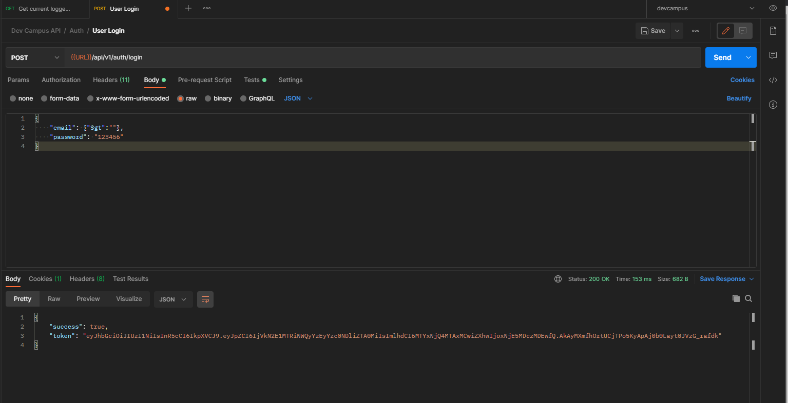

# dev-campus-api
NodeJs Backend

#Using async/await in ExpressJS middlewares
https://www.acuriousanimal.com/blog/2018/03/15/express-async-middleware

      const asyncHandler = fn => (req, res, next) =>
        Promise
          .resolve(fn(req, res, next))
          .catch(next)

#Security

https://blog.websecurify.com/2014/08/hacking-nodejs-and-mongodb.html

example:

#Publish

https://documenter.getpostman.com/view/3974024/TzCFgqLH#c2009ef2-318e-4e9e-8616-d153337920d1